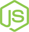
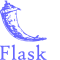
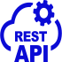

# 👋 Hi, I’m Gregory Kaframanis  
## I'm a Full Stack Web & Software Developer 

- 📖 I'm currently delving deeper into React.js and Node.js.
-  

## My Favorite Technologies
> Programming languages, frameworks, libraries and tools that I use for my work.

|                HTML5               |          CSS3         |          Sass        |  Bootstrap |  JavaScript |     React.js   |
|:-------------------------------------------------------------:|:----------------------------------------------:|:----------------------------------------------:|:----------------------------------------------:|:------------------------------------------------------------:|:---------------------------------------------:|
|            Node.js          |         Redux        |     Python    |        Django      |                Flask               |       Docker      |
|                 Git                |           JSON         |    Rest APIs  |        MySQL       |         PostgreSQL       |  MongoDB |
|  Visual Studio Code |  PyCharm |  WebStorm |                                                |                                                              |                                               |
