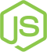
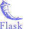
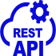

# 👋 Hi, I’m Gregory Kaframanis  

Software Engineer focused on modern web applications, enterprise frontend systems, and maintainable product development.

## What I work with
- React, Next.js, TypeScript
- Redux Toolkit, React Native
- Node.js, Python, SQL
- REST APIs, frontend architecture, production workflows

## What I’m interested in
- Enterprise software engineering
- Scalable frontend architecture
- Product reliability and maintainability
- Cross-functional software delivery

## Links
- Portfolio: https://gkaframanis.dev
- LinkedIn: https://www.linkedin.com/in/gkaframanis

## My Favorite Technologies
> Programming languages, frameworks, libraries and tools that I use for my work.

|                  HTML5               |          CSS3         |          Sass        |  Bootstrap |  JavaScript |      React.js   |
|:-------------------------------------------------------------:|:----------------------------------------------:|:----------------------------------------------:|:----------------------------------------------:|:------------------------------------------------------------:|:---------------------------------------------:|
|            Node.js          |         Redux        |     Python    |        Django      |                Flask               |        Docker      |
|                 Git                |           JSON         |    Rest APIs  |        MySQL       |         PostgreSQL       |   MongoDB |
|  Visual Studio Code |  PyCharm |   WebStorm |                                                |                                                              |                                               |
